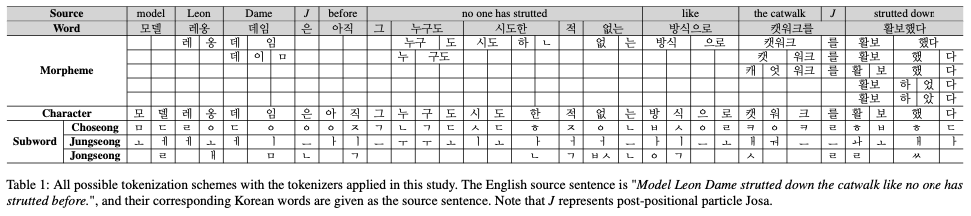

# Guidance to Pre-tokenization for SacreBLEU: Meta-Evaluation in Korean

</a>
[</a>](https://www.kakaoenterprise.com)
</a>

This repository provides datasets and codes for MT evaluation employed in the given publication, written by **Ahrii Kim (김아리)** and **Jinhyeon Kim (김진현)** and submitted at [Preprints.org](https://www.preprints.org/manuscript/202201.0018/v1) (version 1) and [HumEval 2022](https://openreview.net/forum?id=BWVeZdViVW5&referrer=%5BAuthor%20Console%5D(%2Fgroup%3Fid%3Daclweb.org%2FACL%2F2022%2FWorkshop%2FHumEval%2FAuthors%23your-submissions)) (the final version).


## Abstract
SacreBLEU, by incorporating a text normalizing step in the pipeline, has been well-received as an automatic evaluation metric in recent years. With agglutinative languages such as Korean, however, the metric cannot provide a conceivable result without the help of customized pre-tokenization. In this regard, this paper endeavors to examine the influence of diversified pre-tokenization schemes –word, morpheme, character, and subword– on the aforementioned metric by performing meta-evaluation with manually-constructed into-Korean human evaluation data.

Our empirical study demonstrates that the correlation of SacreBLEU, and other homogeneous metrics as an extension, vacillates greatly by the token type. The reliability of the metric even deteriorates due to some tokenization, and **MeCab-ko** is one of its culprits. Guiding through the proper usage of the tokenizer for each metric, we stress the significance of [**Korean Intelligent Word Identifier (Kiwi)**](https://github.com/bab2min/Kiwi) as the most reliable Korean tokenizer and the insignificance of the subword level, **Jamo (자음 & 모음)**, in MT evaluation.


## Dataset
- Base
    - Source Text: English from WMT 20 en-de (2,048 sentences/61 documents)
    - Reference Text: Korean* (manually created)
    - System Translation: 4
- Judgment
    - Human: Direct Assessment (DA) of adequacy & fluency
    - Automatic: [SacreBLEU](https://github.com/mjpost/sacrebleu), BLEU, GLEU, RIBES, NIST, TER, ChrF, [EED](https://aclanthology.org/W19-5359/), and [CharacTER](https://aclanthology.org/W16-2342/)   
    *_For legal issue, a sample of the reference set is publicly available._


## Tokenization
1. **Word Level**
2. **Morpheme Level**
    - [KoNLPy](https://konlpy.org/ko/latest/) (Park and Cho, 2014)
    - [Korean Intelligent Word Identifier (Kiwi)](https://github.com/bab2min/Kiwi)
    - [Kakao Hangul Analyzer III (Khaiii)](https://github.com/kakao/khaiii)
3. **Character Level**
4. **Subword Level**
    - [Sentencepiece](https://github.com/google/sentencepiece)
    - [Jamo](https://pypi.org/project/jamo/)


The implementation of the given tokenizers:
```sh
from tool.tokenizer import *

# the morpheme level
mecab = koNLPy.KoNLPy('mecab') # one of the five
kiwi = kakao.Kiwi()
khaiii = kakao.Khaiii()

# the character level
char = base.Character()

# the subword level
spm = subword.SPM()
jamo = subword.Jamo(jamo_split=True)
```


#### Examplary Tokens

|Type|Tokens|
|---|---|
|Sentence|"모델 레온 데임(20)은 아무도 밟지 않은 것처럼 캣워크를 활보하며 한 발을 다른 발 앞에 강하게 내딛고 활주로를 밟으며 강렬하고 강철 같은 섬광을 그대로 유지했다."|
|Word|`['모델', '레온', '데임(20)은', '아무도', '밟지', '않은', '것처럼', '캣워크를', '활보하며', '한', '발을', '다른', '발', '앞에', '강하게', '내딛고', '활주로를', '밟으며', '강렬하고', '강철', '같은', '섬광을', '그대로', '유지했다.']`|
|MeCab-ko|`['모델', '레온', '데임', '(', '20', ')', '은', '아무', '도', '밟', '지', '않', '은', '것', '처럼', '캣', '워크', '를', '활보', '하', '며', '한', '발', '을', '다른', '발', '앞', '에', '강하', '게', '내딛', '고', '활주로', '를', '밟', '으며', '강렬', '하', '고', '강철', '같', '은', '섬광', '을', '그대로', '유지', '했', '다', '.']`|
|Kiwi|`['모델', '레온', '데이', 'ᆷ', '(', '20', ')', '은', '아무', '도', '밟', '지', '않', '은', '것', '처럼', '캣워크', '를', '활보', '하', '며', '한', '발', '을', '다른', '발', '앞', '에', '강하', '게', '내딛', '고', '활주로', '를', '밟', '으며', '강렬', '하', '고', '강철', '같', '은', '섬광', '을', '그대로', '유지', '하', '었', '다', '.']`|
|Khaiii|`['모델', '레온', '데임', '(', '20', ')', '은', '아무', '도', '밟', '지', '않', '은', '것', '처럼', '캣워크', '를', '활보', '하', '며', '한', '발', '을', '다른', '발', '앞', '에', '강하', '게', '내딛', '고', '활주로', '를', '밟', '으며', '강렬', '하', '고', '강철', '같', '은', '섬광', '을', '그대로', '유지', '하', '였', '다', '.']`|
|Character|`['모', '델', '레', '온', '데', '임', '(', '2', '0', ')', '은', '아', '무', '도', '밟', '지', '않', '은', '것', '처', '럼', '캣', '워', '크', '를', '활', '보', '하', '며', '한', '발', '을', '다', '른', '발', '앞', '에', '강', '하', '게', '내', '딛', '고', '활', '주', '로', '를', '밟', '으', '며', '강', '렬', '하', '고', '강', '철', '같', '은', '섬', '광', '을', '그', '대', '로', '유', '지', '했', '다', '.']`|
|SPM|`['모델', '레', '온', '데', '임', '(', '20', ')', '은', '아무', '도', '밟', '지', '않', '은', '것', '처럼', '', '캣', '워크', '를', '활', '보', '하', '며', '한', '발', '을', '다른', '발', '앞', '에', '강하', '게', '내딛', '고', '활', '주', '로', '를', '밟', '으며', '강렬', '하', '고', '강', '철', '같', '은', '섬', '광', '을', '그대로', '유지', '했', '다', '.'] `|
|Jamo|`['ㅁ', 'ㅗ', 'ㄷ', 'ㅔ', 'ㄹ', ' ', 'ㄹ', 'ㅔ', 'ㅇ', 'ㅗ', 'ㄴ', ' ', 'ㄷ', 'ㅔ', 'ㅇ', 'ㅣ', 'ㅁ', '(', '2', '0', ')', 'ㅇ', 'ㅡ', 'ㄴ', ' ', 'ㅇ', 'ㅏ', 'ㅁ', 'ㅜ', 'ㄷ', 'ㅗ', ' ', 'ㅂ', 'ㅏ', 'ㄼ', 'ㅈ', 'ㅣ', ' ', 'ㅇ', 'ㅏ', 'ㄶ', 'ㅇ', 'ㅡ', 'ㄴ', ' ', 'ㄱ', 'ㅓ', 'ㅅ', 'ㅊ', 'ㅓ', 'ㄹ', 'ㅓ', 'ㅁ', ' ', 'ㅋ', 'ㅐ', 'ㅅ', 'ㅇ', 'ㅝ', 'ㅋ', 'ㅡ', 'ㄹ', 'ㅡ', 'ㄹ', ' ', 'ㅎ', 'ㅘ', 'ㄹ', 'ㅂ', 'ㅗ', 'ㅎ', 'ㅏ', 'ㅁ', 'ㅕ', ' ', ' ', ' ', ' ', ' ', 'ㅎ', 'ㅏ', 'ㄴ', ' ', 'ㅂ', 'ㅏ', 'ㄹ', 'ㅇ', 'ㅡ', 'ㄹ', ' ', 'ㄷ', 'ㅏ', 'ㄹ', 'ㅡ', 'ㄴ', ' ', 'ㅂ', 'ㅏ', 'ㄹ', ' ', 'ㅇ', 'ㅏ', 'ㅍ', 'ㅇ', 'ㅔ', ' ', 'ㄱ', 'ㅏ', 'ㅇ', 'ㅎ', 'ㅏ', 'ㄱ', 'ㅔ', ' ', 'ㄴ', 'ㅐ', 'ㄷ', 'ㅣ', 'ㄷ', 'ㄱ', 'ㅗ', ' ', 'ㅎ', 'ㅘ', 'ㄹ', 'ㅈ', 'ㅜ', 'ㄹ', 'ㅗ', 'ㄹ', 'ㅡ', 'ㄹ', ' ', 'ㅂ', 'ㅏ', 'ㄼ', 'ㅇ', 'ㅡ', 'ㅁ', 'ㅕ', ' ', 'ㄱ', 'ㅏ', 'ㅇ', 'ㄹ', 'ㅕ', 'ㄹ', 'ㅎ', 'ㅏ', 'ㄱ', 'ㅗ', ' ', 'ㄱ', 'ㅏ', 'ㅇ', 'ㅊ', 'ㅓ', 'ㄹ', ' ', 'ㄱ', 'ㅏ', 'ㅌ', 'ㅇ', 'ㅡ', 'ㄴ', ' ', 'ㅅ', 'ㅓ', 'ㅁ', 'ㄱ', 'ㅘ', 'ㅇ', 'ㅇ', 'ㅡ', 'ㄹ', ' ', 'ㄱ', 'ㅡ', 'ㄷ', 'ㅐ', 'ㄹ', 'ㅗ', ' ', 'ㅇ', 'ㅠ', 'ㅈ', 'ㅣ', 'ㅎ', 'ㅐ', 'ㅆ', 'ㄷ', 'ㅏ', '.']`|





## Evaluation Metrics
The following two metrics are copied from the original libraries. You can test their scores with our example as follows:

```sh
[EED]
$ python3 ExtendedEditDistance/EED.py \
        -ref data/ref_example.txt \
        -hyp data/hyp_example.txt

[CharacTER]
$ python3 CharacTER/CharacTER.py \
        -r data/ref_example.txt \
        -o data/hyp_example.txt
```


## Citation
    @inproceedings{kor-sacrebleu22,
        title={Guidance to Pre-tokenization for SacreBLEU: Meta-Evaluation in Korean},
        author={Kim, Ahrii and Kim, Jinhyeon},
        booktitle={Proceedings of the Workshop on Human Evaluation of NLP Systems (HumEval)}
        year={2022}
    }