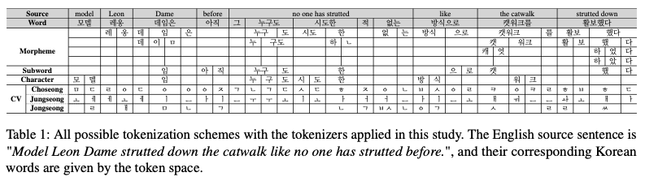

# Vacillating Human Correlation of SacreBLEU in Unprotected Languages

</a>
[</a>](https://www.kakaoenterprise.com)
</a>

This repository provides datasets and codes for MT evaluation employed in the given publication, written by **Ahrii Kim (김아리)** and **Jinhyeon Kim (김진현)** and submitted at [Preprints.org](https://www.preprints.org/manuscript/202201.0018/v1) (1st ver.) and [HumEval 2022](https://openreview.net/forum?id=BWVeZdViVW5&referrer=%5BAuthor%20Console%5D(%2Fgroup%3Fid%3Daclweb.org%2FACL%2F2022%2FWorkshop%2FHumEval%2FAuthors%23your-submissions)) (final ver.).


## Abstract
SacreBLEU, by incorporating a text normalizing step in the pipeline, has become a rising automatic evaluation metric in recent MT studies. With agglutinative languages such as Korean, however, the lexical-level metric cannot provide a conceivable result without a customized pre-tokenization. This paper endeavors to examine the influence of diversified tokenization schemes –word, morpheme, subword, charac- ter, and consonants & vowels (CV)– on the metric after its protective layer is peeled off.

By performing meta-evaluation with manually-constructed into-Korean resources, our empirical study demonstrates that the human correlation of the surface-based metric and other homogeneous ones (as an extension) vacillates greatly by the token type. Moreover, the human correlation of the metric often deteriorates due to some tokenization, with CV one of its culprits. Guiding through the proper usage of tokenizers for the given metric, we discover i) the feasibility of the character tokens and ii) the deficit of CV in the Korean MT evaluation.


## Dataset
- Base
    - Source Text: English from WMT 20 English III-type (2,048 sentences / 61 documents)
    - Reference Text: Korean* (manually created)
    - System Translation: 4 online APIs
- Judgment
    - Human: Direct Assessment (DA) of adequacy & fluency
    - Automatic:
        - BLEU, TER, and ChrF from [SacreBLEU](https://github.com/mjpost/sacrebleu) (Post, 2018), 
        - [NLTK_BLEU](https://www.nltk.org/_modules/nltk/translate/bleu_score.html) (Papineni et al., 2002), 
        - [GLEU](https://www.nltk.org/_modules/nltk/translate/gleu_score.html) (Wu et al., 2016), 
        - [RIBES](http://www.kecl.ntt.co.jp/icl/lirg/ribes/index.html) (Isozaki et al., 2010), 
        - [NIST](https://www.nist.gov/itl/iad/mig/metrics-machine-translation-evaluation/), 
        - [EED](https://github.com/trotacodigos/ExtendedEditDistance) (Wang et al., 2016) 
        - [CharacTER](https://github.com/trotacodigos/CharacTER) (Stanchev et al., 2019)   
    *_For legal issue, a sample of the reference set is publicly available._


## Tokenization
1. **Word Level**
2. **Morpheme Level**
    - [KoNLPy](https://konlpy.org/ko/latest/) (Park and Cho, 2014)
    - [Korean Intelligent Word Identifier (Kiwi)](https://github.com/bab2min/Kiwi)
    - [Kakao Hangul Analyzer III (Khaiii)](https://github.com/kakao/khaiii)
3. **Subword Level**
    - [SentencePiece](https://github.com/google/sentencepiece) (Kudo and Richardson, 2018)   
4. **Character Level**
5. **CV Level**
    - [Jamo](https://pypi.org/project/jamo/)


The implementation of the given tokenizers:
```sh
from tool.tokenizer import *

# the morpheme level
mecab = koNLPy.KoNLPy('mecab') # one of the five
kiwi = kakao.Kiwi()
khaiii = kakao.Khaiii()

# the character level
char = base.Character()

# the subword level
spm = subword.SPM()

# the CV level
jamo = cv.Jamo(jamo_split=True)
```


#### Examplary Tokens




|Type|Tokens|
|---|---|
|Sentence|"모델 레옹 데임은 아직 그 누구도 시도한 적 없는 방식으로 캣워크를 활보했다"|
|Word|`['모델', '레옹', '데임은', '아직', '그', '누구도', '시도한', '적', '없는', '방식으로', '캣워크를', '활보했다']`|
|MeCab-ko|`['모델', '레옹', '데임', '은', '아직', '그', '누구', '도', '시도', '한', '적', '없', '는', '방식', '으로', '캣', '워크', '를', '활보', '했', '다']`|
|Kiwi|`['모델', '레옹', '데이', 'ᆷ', '은', '아직', '그', '누구', '도', '시도', '하', 'ᆫ', '적', '없', '는', '방식', '으로', '캣워크', '를', '활보', '하', '었', '다']`|
|Khaiii|`['모델', '레옹', '데임', '은', '아직', '그', '누구', '도', '시도', '하', 'ㄴ', '적', '없', '는', '방식', '으로', '캣워크', '를', '활보', '하', '였', '다']`|
|SPM|`['모델', '레', '옹', '데', '임', '은', '아직', '그', '누구', '도', '시도', '한', '적', '없', '는', '방식', '으로', '', '캣', '워크', '를', '활', '보', '했', '다']`|
|Character|`['모', '델', '레', '옹', '데', '임', '은', '아', '직', '그', '누', '구', '도', '시', '도', '한', '적', '없', '는', '방', '식', '으', '로', '캣', '워', '크', '를', '활', '보', '했', '다']`|
|CV|`['ㅁ', 'ㅗ', 'ㄷ', 'ㅔ', 'ㄹ', ' ', 'ㄹ', 'ㅔ', 'ㅇ', 'ㅗ', 'ㅇ', ' ', 'ㄷ', 'ㅔ', 'ㅇ', 'ㅣ', 'ㅁ', 'ㅇ', 'ㅡ', 'ㄴ', ' ', 'ㅇ', 'ㅏ', 'ㅈ', 'ㅣ', 'ㄱ', ' ', 'ㄱ', 'ㅡ', ' ', 'ㄴ', 'ㅜ', 'ㄱ', 'ㅜ', 'ㄷ', 'ㅗ', ' ', 'ㅅ', 'ㅣ', 'ㄷ', 'ㅗ', 'ㅎ', 'ㅏ', 'ㄴ', ' ', 'ㅈ', 'ㅓ', 'ㄱ', ' ', 'ㅇ', 'ㅓ', 'ㅄ', 'ㄴ', 'ㅡ', 'ㄴ', ' ', 'ㅂ', 'ㅏ', 'ㅇ', 'ㅅ', 'ㅣ', 'ㄱ', 'ㅇ', 'ㅡ', 'ㄹ', 'ㅗ', ' ', 'ㅋ', 'ㅐ', 'ㅅ', 'ㅇ', 'ㅝ', 'ㅋ', 'ㅡ', 'ㄹ', 'ㅡ', 'ㄹ', ' ', 'ㅎ', 'ㅘ', 'ㄹ', 'ㅂ', 'ㅗ', 'ㅎ', 'ㅐ', 'ㅆ', 'ㄷ', 'ㅏ']`|


## Evaluation Metrics
The following two metrics are copied from the original libraries. You can test their scores with our example as follows:

```sh
[EED]
$ python3 ./tool/metric/ExtendedEditDistance/EED.py \
                -ref data/ref_example.txt \
                -hyp data/hyp_example.txt

[CharacTER]
$ python3 ./tool/metric/CharacTER/CharacTER.py \
                -r data/ref_example.txt \
                -o data/hyp_example.txt
```

## To regenerate figures
The regeneration of the figures of our paper is with the code given below. The options are to choose either the `segment` or `corpus` level and to save the images using `--save`.


```sh
!python3 tool/draw_graph.py 'corpus' --save .
```

## To compute time
```sh
!bash tool/tokenizer.sh data/sample tsv "Ref Hyp" "Kkma Hannanum Okt Komoran Mecab Khaiii Kiwi Spm Syllable CV"
```

## Citation
    @inproceedings{kor-sacrebleu22,
        title={Vacillating Human Correlation of SacreBLEU in Unprotected Languages},
        author={Kim, Ahrii and Kim, Jinhyeon},
        booktitle={Proceedings of the Workshop on Human Evaluation of NLP Systems (HumEval)}
        year={2022}
    }
    
## License
Apache License Version 2.0